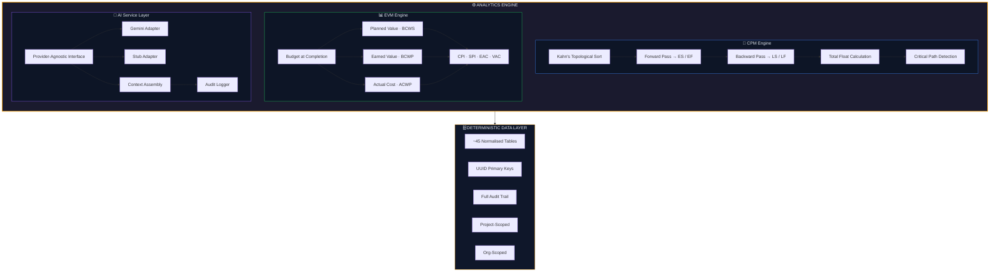
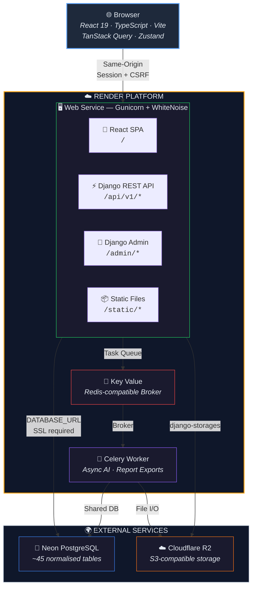
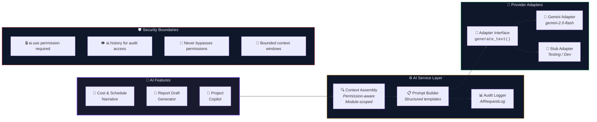

<p align="center">
  
</p>

<h1 align="center">🏗️ BuildPro</h1>
<h3 align="center">Intelligent Construction Project Management Platform</h3>

<p align="center">
  <em>A data-driven operations platform purpose-built for Uganda's construction industry — powered by CPM scheduling, Earned Value analytics, AI-assisted reporting, and a full procurement chain.</em>
</p>

<p align="center">
  <a href="https://buildpro-web.onrender.com"></a>
  
  
  
  
</p>

<p align="center">
  
  
  
  
  
</p>

---

## Why BuildPro?

Construction firms in Uganda rely on spreadsheets, WhatsApp groups, and disconnected tools to manage multi-billion shilling projects. **BuildPro replaces all of that** with a single platform that understands construction workflows — from the first RFQ to the final punch list sign-off.

This is not a generic task manager. Every module, every calculation, and every workflow is construction-aware.

---

## ⚡ Key Highlights

| | Feature | What It Does |
|---|---|---|
| 📐 | **CPM Scheduling Engine** | Forward/backward pass, float calculation, and critical path detection using Kahn's topological sort (PMBOK 7th Edition) |
| 📊 | **Earned Value Management** | Real-time CPI, SPI, EAC, VAC metrics — deterministic, not estimated |
| 🔗 | **Full Procurement Chain** | `RFQ → Quotation → PO → GRN → Invoice → Payment` with item-level tracking |
| 🤖 | **AI-Assisted Reporting** | Google Gemini generates management-ready narratives from structured project data |
| 🔒 | **Granular Permissions** | System roles + per-project memberships with 30+ individual permissions |
| 📄 | **13 Report Types × 4 Formats** | CSV, Excel, PDF, Word — every report exportable |
| 🏗️ | **9 Project Types** | Residential, Commercial, Road, Bridge, School, Hospital, Water/Utility, Industrial, Custom |
| 📑 | **7 Contract Types** | Lump Sum, Remeasurement, Design & Build, Turnkey, Management, BOT/PPP, Custom |

---

## 🧠 Data Science & Analytics Core

BuildPro is fundamentally an **analytics platform** disguised as a project management tool. The construction domain provides the context — the engine underneath is data science:



**Key algorithms implemented:**
- **Critical Path Method (CPM)** — Kahn's topological sort for dependency resolution, forward/backward pass for ES/EF/LS/LF, total float for critical path identification
- **Earned Value Management (EVM)** — Budget at Completion, Planned Value, Earned Value, Actual Cost → CPI, SPI, EAC, VAC, TCPI
- **S-Curve Generation** — Cumulative planned vs. actual progress curves for visual schedule performance tracking
- **Risk Scoring Matrix** — Likelihood × Impact with automatic severity classification

---

## 🏛️ Architecture



> **Same-origin architecture** — Django serves both the API and the built React frontend from a single Render web service. No CORS complexity. Session-based auth with CSRF cookies works naturally.

---

## 📦 Tech Stack

| Layer | Technology | Purpose |
|---|---|---|
| **Frontend** | React 19 + TypeScript + Vite | SPA with TanStack Query + Zustand |
| **Styling** | Tailwind CSS 4.x | Dark professional theme |
| **Backend** | Django 5.2 LTS | Modular monolith — 17 apps |
| **API** | Django REST Framework | RESTful JSON API |
| **Database** | PostgreSQL (Neon) | ~45 normalised tables |
| **Background Jobs** | Celery + Redis | Async AI & report exports |
| **File Storage** | Cloudflare R2 | S3-compatible object storage |
| **AI** | Google Gemini | Provider-agnostic service layer |
| **Static Files** | WhiteNoise | Compressed SPA + Django static |
| **Deployment** | Render | Web + Worker + Key Value |

---

## 🗂️ Platform Modules

### Global Navigation

| Module | Description |
|---|---|
| **Dashboard** | Portfolio-level KPIs, project cards, notification feed |
| **Projects** | Full CRUD with search, filters, archive |
| **Notifications** | Event-driven alerts with severity levels and deep links |
| **Communications** | Project-level chat and meeting coordination |
| **Reports** | Cross-project report hub |
| **Settings** | Users, Roles, Organisation, System info |

### Project Workspace — 23 Modules

| Module | Key Capabilities |
|---|---|
| **Overview & EVM** | Budget vs actual, CPI/SPI/EAC/VAC, progress, milestones |
| **Schedule & CPM** | Phase grouping, dependencies, critical path, recalculation |
| **Gantt Chart** | Custom div-based bars, progress overlay, critical highlighting |
| **Network Diagram** | AON nodes showing ES/DUR/EF, LS/SLACK/LF |
| **S-Curve** | SVG planned vs actual cumulative progress |
| **Milestones** | Target dates, achievement tracking, task linking |
| **Cost & Budget** | 17 budget categories, expenses, variance analysis |
| **Risk Register** | Likelihood × impact scoring, mitigation plans |
| **RFIs** | Due dates, overdue detection, response workflow |
| **Change Orders** | Cost/time impact assessment, approval workflow |
| **Punch List** | Priority, assignee, close workflow |
| **Daily Logs** | Weather, workforce, work performed, delay tracking |
| **Safety** | Incident severity, follow-up actions, lost time indicator |
| **Quality** | Pass/fail/conditional inspections, corrective actions |
| **Site Photos** | Image uploads, grid view, preview |
| **Procurement** | Full 6-stage chain with item-level tracking |
| **Timesheets** | Hours, overtime, task linking, approval |
| **Resources** | Equipment & personnel with project assignments |
| **Meetings** | Minutes, action tracking, due dates |
| **Documents** | Version control, approval workflow, revision history |
| **Reports** | 13 types × 4 formats (CSV / Excel / PDF / Word) |
| **AI Assistant** | Narrative generation, report drafts, project copilot |
| **Recycle Bin** | Soft-deleted item restoration across all field modules |

---

## 🤖 AI Integration



| Feature | Description |
|---|---|
| **Cost & Schedule Narrative** | Management-ready status reports from deterministic project data |
| **AI Report Drafts** | Written summaries for all 13 report types |
| **Project Copilot** | Scoped Q&A using structured project data — no RAG, answers from structured data only |

---

## 🔐 Security & Permissions

BuildPro implements defence-in-depth access control:

- **Session-based authentication** with CSRF protection
- **System roles** — Admin, Management, Standard, Viewer
- **Project memberships** with **30+ granular permissions** (view, edit, approve per module)
- **5 default project roles** — Manager, Engineer, QS, Supervisor, Viewer
- Server-side permission enforcement on every API endpoint
- Input validation, SQL injection prevention, path traversal prevention
- Production safety: app refuses to start without `DATABASE_URL` and R2 credentials

---

## 🧪 Testing

```
186 tests passing
```

| Area | Tests | Coverage |
|---|---|---|
| Authentication & Sessions | 7 | Login, logout, CSRF, session lifecycle |
| Organisation & Users | 5 | User CRUD, org settings |
| Project Access Control | 25 | Membership enforcement, role escalation |
| Scheduling & CPM | 32 | Forward/backward pass, float, critical path |
| Cost & EVM | 11 | Budget lines, expenses, EVM calculations |
| Field Operations | 34 | CRUD + permission checks across 4 modules |
| Procurement & Resources | 27 | Full chain, supplier management, timesheets |
| Documents & Files | 11 | Upload validation, versioning, access control |
| Reports & Exports | 14 | Generation, format validation, authorisation |
| AI Permissions & Providers | 11 | Permission gates, adapter switching, error handling |
| Production Config | 9 | Env validation, startup safety, settings integrity |

---

## 🗄️ Database Design

17 Django apps with **~45 normalised tables** following strict design principles:

- **Normalised data** — no JSONB for core business records
- **UUID primary keys** on all domain models
- **Soft deletes** via `deleted_at` on field operation records
- **Full audit trail** — `created_by`, `updated_by`, `created_at`, `updated_at` on every record
- **Project-scoped** — all operational data isolated per project
- **Org-scoped** — suppliers and resources shared across the organisation

<details>
<summary><strong>Core Models by App</strong></summary>

| App | Models |
|---|---|
| `accounts` | User, Organisation, SystemRole |
| `projects` | Project, ProjectMembership, ProjectSetupConfig |
| `scheduling` | ProjectTask, TaskDependency, Milestone, ScheduleBaseline, BaselineTaskSnapshot |
| `cost` | BudgetLine, Expense |
| `risks` | Risk |
| `rfis` | RFI |
| `changes` | ChangeOrder |
| `field_ops` | PunchItem, DailyLog, SafetyIncident, QualityCheck |
| `procurement` | Supplier, RFQ, RFQItem, Quotation, QuotationItem, PurchaseOrder, POItem, GoodsReceipt, GRNItem, ProcurementInvoice, ProcurementPayment |
| `labour` | TimesheetEntry |
| `resources` | Resource, ProjectResourceAssignment |
| `comms` | Meeting, MeetingAction, ChatMessage |
| `documents` | Document, DocumentVersion |
| `reports` | ReportExport |
| `notifications` | Notification |
| `ai` | AIRequestLog, AsyncJob |

</details>

---

## 🚀 Quick Start

### Prerequisites

- Python 3.12+ &nbsp;|&nbsp; Node.js 20+ &nbsp;|&nbsp; PostgreSQL &nbsp;|&nbsp; Redis (optional)

### 1. Clone & Setup Backend

```bash
git clone https://github.com/Isaac25-lgtm/CONSTRUCTION-MANAGEMENT-SYSTEM.git
cd CONSTRUCTION-MANAGEMENT-SYSTEM/backend

python -m venv .venv
source .venv/bin/activate          # macOS/Linux
# .\.venv\Scripts\Activate.ps1     # Windows PowerShell

pip install -r requirements/development.txt

export DJANGO_SETTINGS_MODULE=buildpro.settings.development
export GEMINI_API_KEY=your-key

python manage.py migrate
python manage.py seed_dev_data --flush
python manage.py runserver 0.0.0.0:8000
```

### 2. Setup Frontend

```bash
cd ../frontend
npm install
npm run dev
```

### 3. Open & Login

| URL | Purpose |
|---|---|
| `http://localhost:5173` | Frontend (Vite + HMR) |
| `http://localhost:8000/admin/` | Django Admin |
| `http://localhost:8000/api/health/` | Health Check |

**Test accounts** (password: `buildpro123`):

| User | Role | Access |
|---|---|---|
| `jesse` | Admin | Full access, all 5 projects |
| `sarah` | Management | Broad access, all 5 projects |
| `patrick` | Standard | 2 projects (manager) |
| `grace` | Standard | 3 projects (QS role) |
| `david` | Viewer | 2 projects (read-only) |

---

## 📁 Project Structure

<details>
<summary><strong>Expand full directory tree</strong></summary>

```
CONSTRUCTION-MANAGEMENT-SYSTEM/
├── render.yaml                    # Render Blueprint
├── Dockerfile.render              # Multi-stage production image
├── docker-compose.yml             # Local dev (PostgreSQL + Redis)
├── buildpro.html                  # Golden UI prototype reference
│
├── backend/                       # Django 5.2 LTS
│   ├── buildpro/                  # Project config
│   │   ├── settings/              # base / development / production
│   │   ├── urls.py                # Root URLs + SPA catch-all
│   │   ├── wsgi.py                # Strict env validation
│   │   └── celery.py              # Celery config
│   └── apps/                      # 17 Django apps
│       ├── core/                  # Base models, mixins, permissions
│       ├── accounts/              # Users, roles, org, auth
│       ├── projects/              # Projects, memberships, setup engine
│       ├── scheduling/            # CPM engine, tasks, milestones
│       ├── cost/                  # Budget, expenses, EVM
│       ├── risks/                 # Risk register
│       ├── rfis/                  # RFI tracking
│       ├── changes/               # Change orders
│       ├── field_ops/             # Punch list, daily logs, safety, quality
│       ├── procurement/           # Full 6-stage procurement chain
│       ├── labour/                # Timesheets
│       ├── resources/             # Equipment & personnel
│       ├── comms/                 # Meetings, chat
│       ├── documents/             # Version-controlled documents
│       ├── reports/               # 13 report types, 4 formats
│       ├── notifications/         # Event-driven alerts
│       └── ai/                    # Provider-agnostic AI layer
│
├── frontend/                      # React 19 + TypeScript + Vite
│   └── src/
│       ├── api/                   # Axios + CSRF handling
│       ├── hooks/                 # 18 TanStack Query hooks
│       ├── pages/                 # 31 page components
│       ├── components/            # Layout + Shared + 17 UI primitives
│       ├── stores/                # Zustand state
│       └── types/                 # Shared TypeScript types
│
├── docs/                          # Architecture & handoff documentation
└── deploy/                        # Self-hosted deployment configs
```

</details>

---

## 📜 API Reference

> 80+ RESTful endpoints across 11 resource groups. Session-authenticated with CSRF protection.

<details>
<summary><strong>Authentication</strong></summary>

| Method | Endpoint | Description |
|---|---|---|
| `GET` | `/api/v1/auth/csrf/` | Bootstrap CSRF cookie |
| `POST` | `/api/v1/auth/login/` | Login |
| `POST` | `/api/v1/auth/logout/` | Logout |
| `GET` | `/api/v1/auth/me/` | Current user + permissions |
| `GET/POST` | `/api/v1/auth/users/` | List/create users (admin) |
| `GET/PATCH` | `/api/v1/auth/organisation/` | Get/update org settings |

</details>

<details>
<summary><strong>Projects & Scheduling</strong></summary>

| Method | Endpoint | Description |
|---|---|---|
| `GET/POST` | `/api/v1/projects/` | List/create projects |
| `GET/PATCH` | `/api/v1/projects/{id}/` | Project detail |
| `POST` | `/api/v1/projects/{id}/archive/` | Archive project |
| `GET/POST` | `/api/v1/scheduling/{pid}/tasks/` | Tasks |
| `POST` | `/api/v1/scheduling/{pid}/recalculate/` | Run CPM engine |
| `GET` | `/api/v1/scheduling/{pid}/gantt/` | Gantt data |
| `GET` | `/api/v1/scheduling/{pid}/network/` | Network diagram data |
| `GET` | `/api/v1/scheduling/{pid}/scurve/` | S-Curve data |
| `GET/POST` | `/api/v1/scheduling/{pid}/milestones/` | Milestones |
| `GET/POST` | `/api/v1/scheduling/{pid}/baselines/` | Schedule baselines |

</details>

<details>
<summary><strong>Cost, Procurement & Field Ops</strong></summary>

| Method | Endpoint | Description |
|---|---|---|
| `GET/POST` | `/api/v1/cost/{pid}/budget-lines/` | Budget lines |
| `GET/POST` | `/api/v1/cost/{pid}/expenses/` | Expenses |
| `GET` | `/api/v1/cost/{pid}/evm/` | EVM metrics |
| `GET` | `/api/v1/cost/{pid}/overview/` | Project overview |
| `GET/POST` | `/api/v1/procurement/{pid}/rfqs/` | RFQs |
| `GET/POST` | `/api/v1/procurement/{pid}/purchase-orders/` | Purchase Orders |
| `GET/POST` | `/api/v1/procurement/{pid}/goods-receipts/` | Goods Receipts |
| `GET/POST` | `/api/v1/risks/{pid}/risks/` | Risk Register |
| `GET/POST` | `/api/v1/rfis/{pid}/rfis/` | RFIs |
| `GET/POST` | `/api/v1/changes/{pid}/change-orders/` | Change Orders |
| `GET/POST` | `/api/v1/field-ops/{pid}/punch-items/` | Punch List |
| `GET/POST` | `/api/v1/field-ops/{pid}/daily-logs/` | Daily Logs |
| `GET/POST` | `/api/v1/field-ops/{pid}/safety-incidents/` | Safety |
| `GET/POST` | `/api/v1/field-ops/{pid}/quality-checks/` | Quality |

</details>

<details>
<summary><strong>Documents, Reports, AI & More</strong></summary>

| Method | Endpoint | Description |
|---|---|---|
| `GET/POST` | `/api/v1/documents/{pid}/documents/` | Documents |
| `POST` | `/api/v1/documents/{pid}/documents/{did}/versions/` | New version |
| `POST` | `/api/v1/reports/{pid}/generate/` | Generate export |
| `GET` | `/api/v1/reports/{pid}/history/` | Export history |
| `POST` | `/api/v1/ai/{pid}/narrative/` | AI narrative |
| `POST` | `/api/v1/ai/{pid}/copilot/` | AI copilot Q&A |
| `GET/POST` | `/api/v1/comms/{pid}/chat/` | Project chat |
| `GET/POST` | `/api/v1/comms/{pid}/meetings/` | Meetings |
| `GET/POST` | `/api/v1/labour/{pid}/timesheets/` | Timesheets |
| `GET/POST` | `/api/v1/resources/{pid}/resource-assignments/` | Resource assignments |
| `GET` | `/api/v1/notifications/notifications/` | Notifications |

</details>

---

## 🌍 Production Deployment

Deployed on **[Render](https://render.com)** using a Blueprint (`render.yaml`):

| Service | Type | Purpose |
|---|---|---|
| `buildpro-web` | Web Service (Docker) | Django + React SPA |
| `buildpro-worker` | Background Worker | Celery (async AI & exports) |
| `buildpro-kv` | Key Value (Redis) | Task broker |
| **Neon** | Managed PostgreSQL | Primary database |
| **Cloudflare R2** | Object Storage | Documents, photos, exports |

### Deploy from GitHub

1. Connect repo to Render → **New > Blueprint**
2. Set env vars: `DATABASE_URL`, `ALLOWED_HOSTS`, `CSRF_TRUSTED_ORIGINS`, `GEMINI_API_KEY`, R2 credentials
3. Deploy — Docker builds the image, pre-deploy runs migrations
4. Create admin: `cd /app/backend && python manage.py createsuperuser`

**Production safety:**
- App refuses to start without `DATABASE_URL` (raises `ImproperlyConfigured`)
- App refuses to start without R2 storage credentials
- `wsgi.py` and `celery.py` reject startup without explicit `DJANGO_SETTINGS_MODULE`
- No silent fallbacks to development settings

---

## 👥 Authors

<table>
  <tr>
    <td align="center">
      <strong>Isaac Omoding</strong><br/>
      <em>Data Scientist & Co-Founder</em><br/>
      <sub>Platform architecture, analytics engine, AI integration</sub>
    </td>
    <td align="center">
      <strong>Jesse Limo Mwanga</strong><br/>
      <em>Civil Engineer (MSc) & Co-Founder</em><br/>
      <sub>Domain expertise, CPM/EVM design, construction workflows</sub>
    </td>
  </tr>
</table>

<p align="center">
  <a href="https://locusanalytics.tech"><strong>Locus Analytics</strong></a><br/>
  <sub>Plot 75 Bukoto Street, Kamwokya, Kampala, Uganda</sub>
</p>

---

<p align="center">
  <strong>Built with precision for Uganda's construction industry.</strong><br/>
  <sub>© 2026 Locus Analytics. All rights reserved.</sub>
</p>
